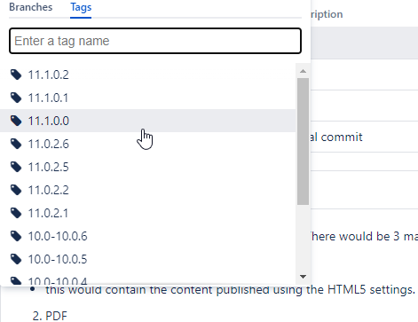

# TestLogic Server #
## This page is for documenting TestLogic Server ##
TestLogic server is a very cool program that does amazing things.

## Hyperlinks ##
This is a reference page for jekyl markdown

https://www.markdownguide.org/extended-syntax/#automatic-url-linking

## Code Blocks ##
This code does some amazing things:
```
words = 'super cool app dude'
print(words)
```
## Tables ##

| Syntax      | Description |
| ----------- | ----------- |
| Header      | Title       |
| Paragraph   | Text        |

## Italics ##
 
This is some *italic* text  

## Bold ##

This is some **bold** text

## Block Text ##
> This is a block quote
> 
> interesting block eh?

## Ordered List ## 

1. This is first
2. This is second
3. 7sdfsdf
   
## Unordered list ##
- Number One
- The other stuff

## A task list ##
- [x] Write the press release
- [ ] Update the website
- [ ] Contact the media

## Inserting an Image ##

{:class="img-responsive"}



## Syntax Highlighting ## 
```json
{
  "firstName": "John",
  "lastName": "Smith",
  "age": 25
}
```
